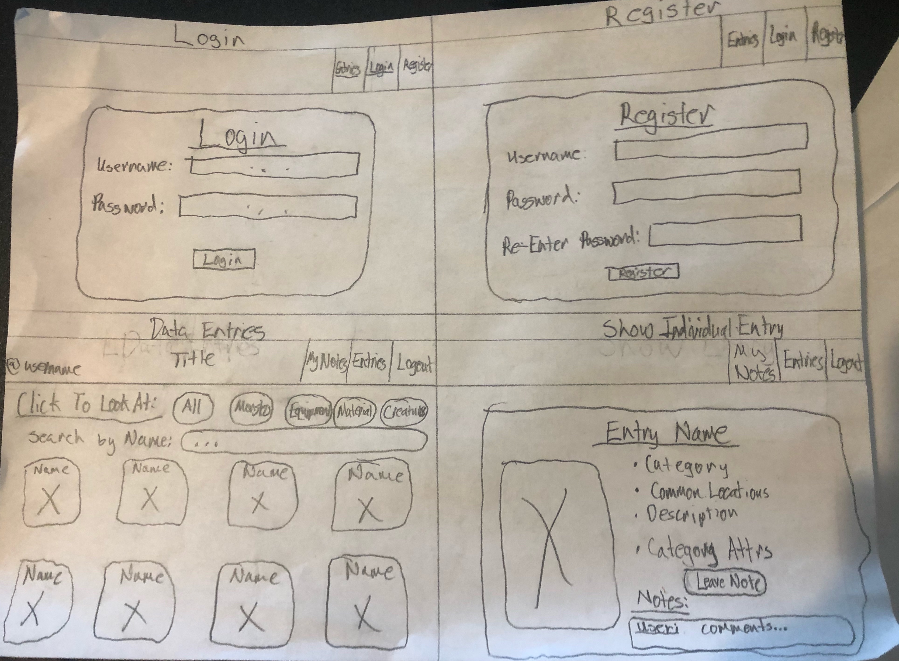
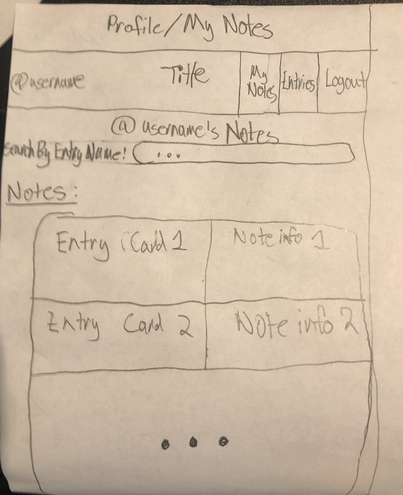
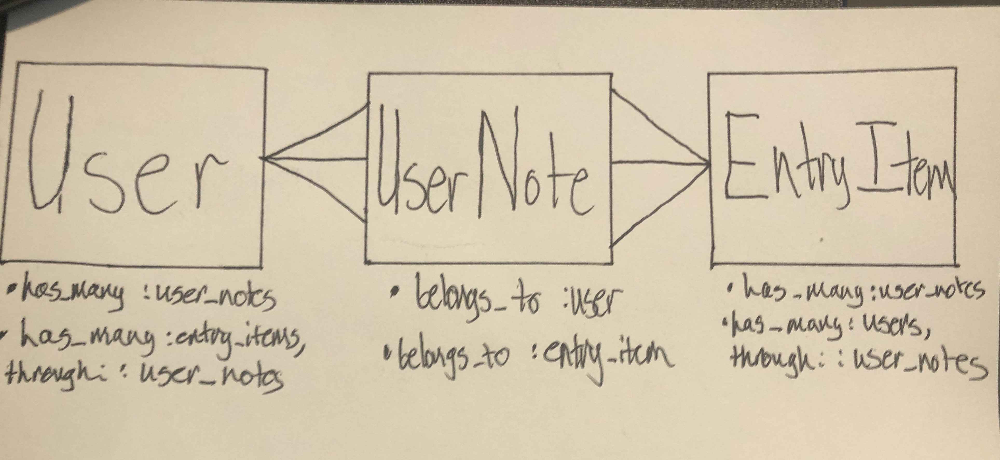

# Welcome to Link's Library

## 'The Legend of Zelda: Breath of the Wild' API: https://gadhagod.github.io/Hyrule-Compendium-API/#/?id=category

## Quick Background
For those of you who don't know, 'The Legend of Zelda: Breath of the Wild'is an open-world action-adventure game from the Zelda franchise that takes place at the end of the Zelda timeline. The games are known to give little instruction due to the developers' desire to reward exploring and experimenting, which can make it hard to keep track of everything a player wants to remember.

## Why This Project?
I started the process of deciding a final project knowing that I wanted to do something in relation video-games, as I have always enjoyed playing them. My interest in video-games, and finding a fun API for a game that I really enjoyed, led me to my decision to make an application about the game. My target functionality was decided when I remembered that throughout my time playing the game, I struggled to keep track of all the information I wanted to remember, as the map is ginormous and there are so many things to do. So, I created a program that would allow users to see more info about all the monsters, equipment items, and materials needing for cooking in the game. I also wanted a player to be able to post the information that they found to be relevant for a certain entry, as it would allow players to share experiences and more detailed information they wish they had known earlier. 

## Wireframe

## User Statements
### Minimum Viable Product (MVP)
- As a user I can sign-up for an account, or login to my account
- As a user I can see all the entry items on a browse page
- As a user I can use filter buttons to filter the entries by category type
- As a user I can then search for an individual item with the category (or all) by name
- As a user I can select an individual item for more info
- As a user I can write a note for later reference, which will also be saved to my notes after giving a commentary
- As a user I can maneuver to my saved notes page through a navbar link and see all the notes I made with the item they are for
### Stretch Goals
- As a user I can search for an individual note by entry name on my profile page
- As a user I can edit a note directly from my profile page
- As a user I can I can sort my notes on my user notes page

## Models

- User:
  - Attributes:
    - id (int)
    - username (string)
- UserNote:
  - Attributes:
    - id (int)
    - comment (text)
    - user_id (int)
    - entry_item_id (int)
    - username (string)
    - entry_name (string)
- EntryItem:
  - Attributes:
    - id (int)
    - name (string)
    - image (string)
    - original_id (int)

## Technologies Implemented
### Backend - Ruby on Rails as API
- JWT Authentication
- Custom Routes
- Rails Validations
- Rest-Client Gem
### Frontend - React
- React-router
- React-hooks
- Media-queries

## Extra-Info
One of my biggest challenges was making the application update with the External API data if an update or dlc were to come out. I was able to achieve this using the rest-client gem to fetch the entry data from my controller-index method.

## Next Steps
- Implementing a user show route that takes you to another user's profile page with all their notes
- Adding functionality to click on a note in a user's profile and being brough to the show page of that note
- Add a likes model in my backend so that I can implement a feature that allows users to like notes of another user